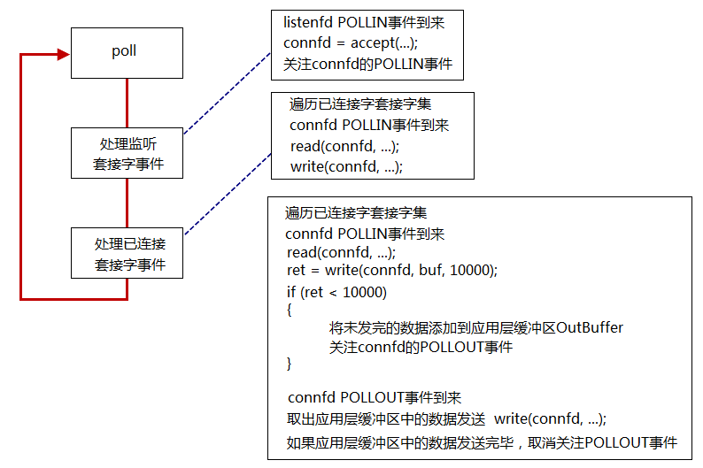
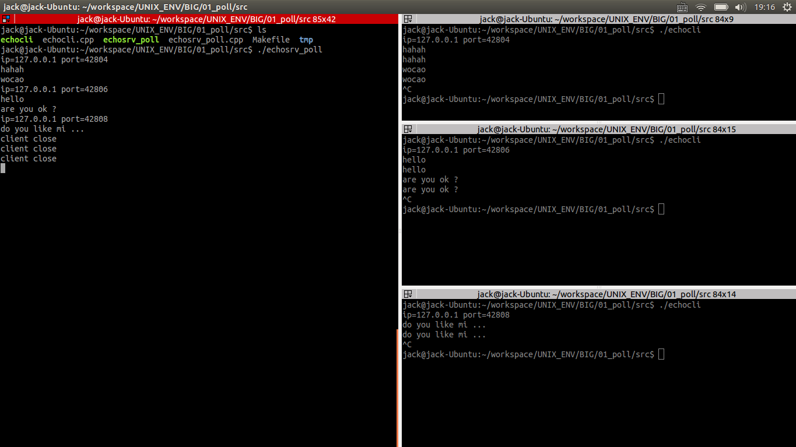

## POLL 模型##

### 一、函数原型 ###

```cpp
#include <poll.h>
int poll(struct pollfd *fds, nfds_t nfds, int timeout);

struct pollfd {
	int   fd;	/* file descriptor */
	short events;	/* requested events */
	short revents;	/* returned events */
};
```

### 二、poll使用基本流程 ###



### 三、代码案例 ###

#### server ####

```cpp
#include <unistd.h>
#include <sys/types.h>
#include <fcntl.h>
#include <sys/socket.h>
#include <netinet/in.h>
#include <arpa/inet.h>
#include <signal.h>
#include <sys/wait.h>
#include <poll.h>

#include <stdlib.h>
#include <stdio.h>
#include <errno.h>
#include <string.h>

#include <vector>
#include <iostream>

#define ERR_EXIT(m) \
        do \
        { \
                perror(m); \
                exit(EXIT_FAILURE); \
        } while(0)

typedef std::vector<struct pollfd> PollFdList;

int main(void)
{
	signal(SIGPIPE, SIG_IGN);
	signal(SIGCHLD, SIG_IGN);

	int listenfd;

	//if ((listenfd = socket(PF_INET, SOCK_STREAM, IPPROTO_TCP)) < 0)
	if ((listenfd = socket(PF_INET, SOCK_STREAM | SOCK_NONBLOCK | SOCK_CLOEXEC, IPPROTO_TCP)) < 0)
		ERR_EXIT("socket");

	struct sockaddr_in servaddr;
	memset(&servaddr, 0, sizeof(servaddr));
	servaddr.sin_family = AF_INET;
	servaddr.sin_port = htons(5188);
	servaddr.sin_addr.s_addr = htonl(INADDR_ANY);

	int on = 1;
	if (setsockopt(listenfd, SOL_SOCKET, SO_REUSEADDR, &on, sizeof(on)) < 0)
		ERR_EXIT("setsockopt");

	if (bind(listenfd, (struct sockaddr*)&servaddr, sizeof(servaddr)) < 0)
		ERR_EXIT("bind");
	if (listen(listenfd, SOMAXCONN) < 0)
		ERR_EXIT("listen");

	struct pollfd pfd;
	pfd.fd = listenfd;
	pfd.events = POLLIN;

	PollFdList pollfds;
	pollfds.push_back(pfd);

	int nready;

	struct sockaddr_in peeraddr;
	socklen_t peerlen;
	int connfd;

	while (1)
	{
		nready = poll(&*pollfds.begin(), pollfds.size(), -1);
		if (nready == -1)
		{
			if (errno == EINTR)
				continue;
			
			ERR_EXIT("poll");
		}
		if (nready == 0)	// nothing happended
			continue;
		
		if (pollfds[0].revents & POLLIN)
		{
			peerlen = sizeof(peeraddr);
			connfd = accept4(listenfd, (struct sockaddr*)&peeraddr,
						&peerlen, SOCK_NONBLOCK | SOCK_CLOEXEC);

			if (connfd == -1)
				ERR_EXIT("accept4");

			pfd.fd = connfd;
			pfd.events = POLLIN;
			pfd.revents = 0;
			pollfds.push_back(pfd);
			--nready;

			// 连接成功
			std::cout<<"ip="<<inet_ntoa(peeraddr.sin_addr)<<
				" port="<<ntohs(peeraddr.sin_port)<<std::endl;
			if (nready == 0)
				continue;
		}

		//std::cout<<pollfds.size()<<std::endl;
		//std::cout<<nready<<std::endl;
		for (PollFdList::iterator it=pollfds.begin()+1;
			it != pollfds.end() && nready >0; ++it)
		{
				if (it->revents & POLLIN)
				{
					--nready;
					connfd = it->fd;
					char buf[1024] = {0};
					int ret = read(connfd, buf, 1024);
					if (ret == -1)
						ERR_EXIT("read");
					if (ret == 0)
					{
						std::cout<<"client close"<<std::endl;
						it = pollfds.erase(it);
						--it;

						close(connfd);
						continue;
					}

					std::cout<<buf;
					write(connfd, buf, strlen(buf));
					
				}
		}
	}

	return 0;
}
```

#### client ####

```cpp
#include <unistd.h>
#include <sys/types.h>
#include <sys/socket.h>
#include <netinet/in.h>
#include <arpa/inet.h>

#include <stdlib.h>
#include <stdio.h>
#include <errno.h>
#include <string.h>

#include <iostream>

#define ERR_EXIT(m) \
        do \
        { \
                perror(m); \
                exit(EXIT_FAILURE); \
        } while(0)

int main(void)
{
	int sock;
	if ((sock = socket(PF_INET, SOCK_STREAM, IPPROTO_TCP)) < 0)
		ERR_EXIT("socket");

	struct sockaddr_in servaddr;
	memset(&servaddr, 0, sizeof(servaddr));
	servaddr.sin_family = AF_INET;
	servaddr.sin_port = htons(5188);
	servaddr.sin_addr.s_addr = inet_addr("127.0.0.1");

	if (connect(sock, (struct sockaddr*)&servaddr, sizeof(servaddr)) < 0)
		ERR_EXIT("connect");

	struct sockaddr_in localaddr;
	socklen_t addrlen = sizeof(localaddr);
	if (getsockname(sock, (struct sockaddr*)&localaddr, &addrlen) < 0)
	ERR_EXIT("getsockname");

	std::cout<<"ip="<<inet_ntoa(localaddr.sin_addr)<<
		" port="<<ntohs(localaddr.sin_port)<<std::endl;

	char sendbuf[1024] = {0};
	char recvbuf[1024] ={0};
	while (fgets(sendbuf, sizeof(sendbuf), stdin) != NULL)
	{
		write(sock, sendbuf, strlen(sendbuf));
		read(sock, recvbuf, sizeof(recvbuf));

		fputs(recvbuf, stdout);
		memset(sendbuf, 0, sizeof(sendbuf));
		memset(recvbuf, 0, sizeof(recvbuf));
	}

	close(sock);
	
	return 0;
}
```

#### Makefile ####

```
.PHONY:clean
CC=g++
CPPFLAGS=-Wall -g
BIN=echosrv_poll echocli
all:$(BIN)
%.o:%.c
	$(CC) $(CFLAGS) -c $< -o $@
clean:
	rm -f *.o $(BIN)
```

编译运行结果如下：



### 四、EMFILE处理 ###

EMFILE即文件描述符已经用尽，系统达到了最大的连接量。

accept(2)返回EMFILE的处理：

- 调高进程文件描述符数目
- 死等
- 退出程序
- 关闭监听套接字。那什么时候重新打开呢？
- 如果是epoll模型，可以改用edge trigger。问题是如果漏掉了一次accept(2)，程序再也不会收到新连接。
- 准备一个空闲的文件描述符。遇到这种情况，先关闭这个空闲文件，获得一个文件描述符名额;再accept(2)拿到socket连接的文件描述符；随后立刻close(2)，这样就优雅地断开了与客户端的连接；最后重新打开空闲文件，把“坑”填上，以备再次出现这种情况时使用。

这里采用最后一种方法，上面的server代码修改如下：

```cpp
#include <unistd.h>
#include <sys/types.h>
#include <fcntl.h>
#include <sys/socket.h>
#include <netinet/in.h>
#include <arpa/inet.h>
#include <signal.h>
#include <sys/wait.h>
#include <poll.h>

#include <stdlib.h>
#include <stdio.h>
#include <errno.h>
#include <string.h>

#include <vector>
#include <iostream>

#define ERR_EXIT(m) \
        do \
        { \
                perror(m); \
                exit(EXIT_FAILURE); \
        } while(0)

typedef std::vector<struct pollfd> PollFdList;

int main(void)
{
	signal(SIGPIPE, SIG_IGN);
	signal(SIGCHLD, SIG_IGN);

	int idlefd = open("/dev/null", O_RDONLY | O_CLOEXEC);
	int listenfd;

	//if ((listenfd = socket(PF_INET, SOCK_STREAM, IPPROTO_TCP)) < 0)
	if ((listenfd = socket(PF_INET, SOCK_STREAM | SOCK_NONBLOCK | SOCK_CLOEXEC, IPPROTO_TCP)) < 0)
		ERR_EXIT("socket");

	struct sockaddr_in servaddr;
	memset(&servaddr, 0, sizeof(servaddr));
	servaddr.sin_family = AF_INET;
	servaddr.sin_port = htons(5188);
	servaddr.sin_addr.s_addr = htonl(INADDR_ANY);

	int on = 1;
	if (setsockopt(listenfd, SOL_SOCKET, SO_REUSEADDR, &on, sizeof(on)) < 0)
		ERR_EXIT("setsockopt");

	if (bind(listenfd, (struct sockaddr*)&servaddr, sizeof(servaddr)) < 0)
		ERR_EXIT("bind");
	if (listen(listenfd, SOMAXCONN) < 0)
		ERR_EXIT("listen");

	struct pollfd pfd;
	pfd.fd = listenfd;
	pfd.events = POLLIN;

	PollFdList pollfds;
	pollfds.push_back(pfd);

	int nready;

	struct sockaddr_in peeraddr;
	socklen_t peerlen;
	int connfd;

	while (1)
	{
		nready = poll(&*pollfds.begin(), pollfds.size(), -1);
		if (nready == -1)
		{
			if (errno == EINTR)
				continue;
			
			ERR_EXIT("poll");
		}
		if (nready == 0)	// nothing happended
			continue;
		
		if (pollfds[0].revents & POLLIN)
		{
			peerlen = sizeof(peeraddr);
			connfd = accept4(listenfd, (struct sockaddr*)&peeraddr,
						&peerlen, SOCK_NONBLOCK | SOCK_CLOEXEC);

			if (connfd == -1)
			{
				if (errno == EMFILE)
				{
					close(idlefd);
					idlefd = accept(listenfd, NULL, NULL);
					close(idlefd);
					idlefd = open("/dev/null", O_RDONLY | O_CLOEXEC);
					continue;
				}
				else
					ERR_EXIT("accept4");
			}

			pfd.fd = connfd;
			pfd.events = POLLIN;
			pfd.revents = 0;
			pollfds.push_back(pfd);
			--nready;

			std::cout<<"ip="<<inet_ntoa(peeraddr.sin_addr)<<
				" port="<<ntohs(peeraddr.sin_port)<<std::endl;
			if (nready == 0)
				continue;
		}

		//std::cout<<pollfds.size()<<std::endl;
		//std::cout<<nready<<std::endl;
		for (PollFdList::iterator it=pollfds.begin()+1;
			it != pollfds.end() && nready >0; ++it)
		{
				if (it->revents & POLLIN)
				{
					--nready;
					connfd = it->fd;
					char buf[1024] = {0};
					int ret = read(connfd, buf, 1024);
					if (ret == -1)
						ERR_EXIT("read");
					if (ret == 0)
					{
						std::cout<<"client close"<<std::endl;
						it = pollfds.erase(it);
						--it;

						close(connfd);
						continue;
					}

					std::cout<<buf;
					write(connfd, buf, strlen(buf));
					
				}
		}
	}

	return 0;
}
```

这里添加了一个空的文件描述符：

```cpp
int idlefd = open("/dev/null", O_RDONLY | O_CLOEXEC);
```

然后如果accept出错出现EMFILE错误，则有：

```cpp
if (connfd == -1)
{
    if (errno == EMFILE)
    {
        close(idlefd);
        idlefd = accept(listenfd, NULL, NULL);
        close(idlefd);
        idlefd = open("/dev/null", O_RDONLY | O_CLOEXEC);
        continue;
    }
    else
        ERR_EXIT("accept4");
}
```

这里让这个空的文件描述符不断地接受连接然后关闭，不断缓冲连接，有点蛇皮走位的味道。

### 补充一：SIGPIPE信号　###

默认情况下，往一个读端关闭的管道或者socket连接中写数据将引发SIGPIPE信号。我们需要在代码中捕获并处理该信号，或者至少忽略它，因为程序接收到该信号的默认行为是结束进程，而我们绝对不希望因为错误的写操作而导致进程退出。

如果客户端关闭了套接字socket，而服务器调用了一次write，服务器会接收到一个RST segment(TCP传输层)，如果服务器端再次调用write，这时就会产生SIGPIPE信号。

### 补充二：SIGCHLD信号　###

首先内核会释放终止进程(调用了exit系统调用)所使用的所有存储区，关闭所有打开的文件等，但内核为每一个终止子进程保存了一定量的信息。这些信息至少包括进程ID，进程的终止状态，以及该进程使用的CPU时间，所以当终止子进程的父进程调用wait或waitpid时就可以得到这些信息。

而僵尸进程就是指：一个进程执行了exit系统调用退出，而其父进程并没有为它收尸(调用wait或waitpid来获得它的结束状态)的进程。

任何一个子进程(init除外)在exit后并非马上就消失，而是留下一个称外僵尸进程的数据结构，等待父进程处理。这是每个子进程都必需经历的阶段。另外子进程退出的时候会向其父进程发送一个SIGCHLD信号。

设置僵死状态的目的是维护子进程的信息，以便父进程在以后某个时候获取。这些信息至少包括进程ID，进程的终止状态，以及该进程使用的CPU时间，所以当终止子进程的父进程调用wait或waitpid时就可以得到这些信息。如果一个进程终止，而该进程有子进程处于僵尸状态，那么它的所有僵尸子进程的父进程ID将被重置为1（init进程）。继承这些子进程的init进程将清理它们（也就是说init进程将wait它们，从而去除它们的僵尸状态）。

通过signal(SIGCHLD, SIG_IGN)通知内核对子进程的结束不关心，由内核回收。如果不想让父进程挂起，可以在父进程中加入一条语句：signal(SIGCHLD,SIG_IGN);表示父进程忽略SIGCHLD信号，该信号是子进程退出的时候向父进程发送的。该方法忽略SIGCHLD信号，这常用于并发服务器的性能的一个技巧因为并发服务器常常fork很多子进程，子进程终结之后需要服务器进程去wait清理资源。如果将此信号的处理方式设为忽略，可让内核把僵尸子进程转交给init进程去处理，省去了大量僵尸进程占用系统资源

### 补充三：TIME_WAIT状态对大并发服务器的影响 ###

应该尽可能在服务器端避免TIME_WAIT状态。如果服务器端主动断开连接（先于client调用close），服务器就会进入TIME_WAIT状态。

协议设计上应该让客户端主动断开连接，这样就把TIME_WAIT状态分散到大量的客户端，如果客户端不活跃了，一些（恶意的）客户端不断开连接，这样就会占用服务器的连接资源，所以服务器端也需要有一种机制来踢掉不活跃的连接。
