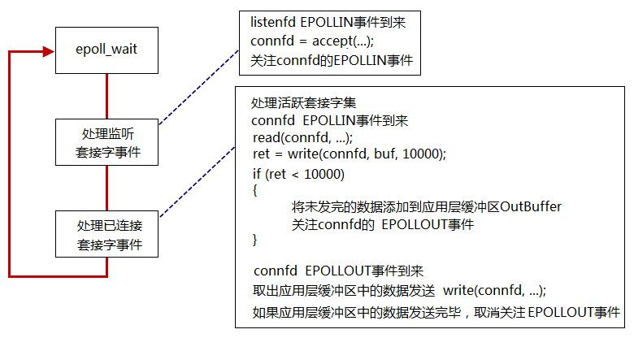
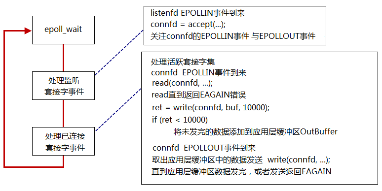
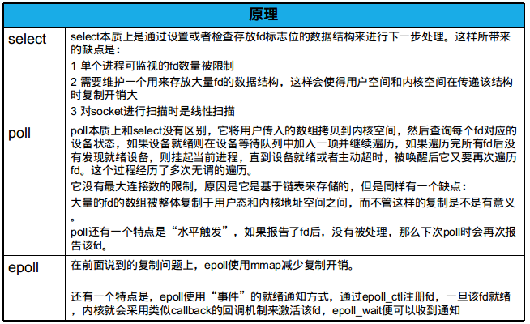
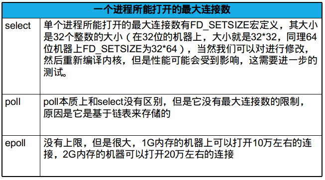
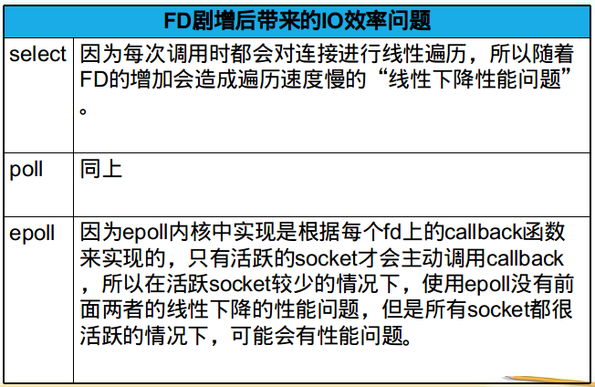
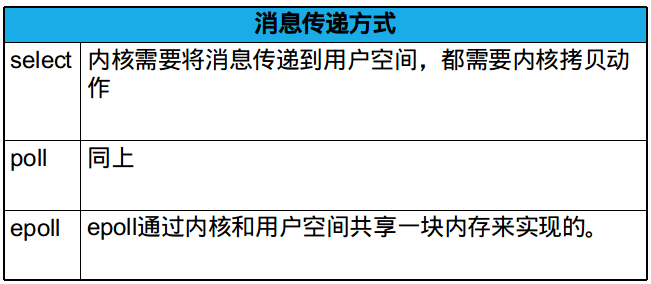

## epoll ##

### 一、操作函数 ###

```cpp
#include <sys/epoll.h>
int epoll_create(int size);
int epoll_create1(int flags);

int epoll_ctl(int epfd, int op, int fd, struct epoll_event *event);
int epoll_wait(int epfd, struct epoll_event *events, int maxevents, int timeout);

typedef union epoll_data {
	void    *ptr;
	int      fd;
	uint32_t u32;
	uint64_t u64;
} epoll_data_t;

struct epoll_event {
	uint32_t     events;	/* Epoll events */
	epoll_data_t data;	/* User data variable */
};
```

### 二、两种触发模式 ###

- Level-Triggered
- Edge-Triggered

需要注意的是EPOLLIN和EPOLLOUT事件来临的时机：

- EPOLLIN事件

当内核中的socket接收缓冲区为空，则为低电平；内核中的socket接收缓冲区不为空，则为高电平。

- EPOLLOUT事件

内核中的socket发送缓冲区满了则为高电平，否则为低电平

epoll的LT为高电平触发；ET为边缘触发。

#### 1.Level-Triggered ####

工作模式和poll类似，工作方式如下图所示：



#### 2.Edge-Triggered ####



服务端代码如下：

```cpp
#include <unistd.h>
#include <sys/types.h>
#include <fcntl.h>
#include <sys/socket.h>
#include <netinet/in.h>
#include <arpa/inet.h>
#include <signal.h>
#include <fcntl.h>
#include <sys/wait.h>
#include <sys/epoll.h>

#include <stdlib.h>
#include <stdio.h>
#include <errno.h>
#include <string.h>

#include <vector>
#include <algorithm>
#include <iostream>

typedef std::vector<struct epoll_event> EventList;

#define ERR_EXIT(m) \
        do \
        { \
                perror(m); \
                exit(EXIT_FAILURE); \
        } while(0)

int main(void)
{
	signal(SIGPIPE, SIG_IGN);
	signal(SIGCHLD, SIG_IGN);

	int idlefd = open("/dev/null", O_RDONLY | O_CLOEXEC);
	int listenfd;
	//if ((listenfd = socket(PF_INET, SOCK_STREAM, IPPROTO_TCP)) < 0)
	if ((listenfd = socket(PF_INET, SOCK_STREAM | SOCK_NONBLOCK | SOCK_CLOEXEC, IPPROTO_TCP)) < 0)
		ERR_EXIT("socket");

	struct sockaddr_in servaddr;
	memset(&servaddr, 0, sizeof(servaddr));
	servaddr.sin_family = AF_INET;
	servaddr.sin_port = htons(5188);
	servaddr.sin_addr.s_addr = htonl(INADDR_ANY);

	int on = 1;
	if (setsockopt(listenfd, SOL_SOCKET, SO_REUSEADDR, &on, sizeof(on)) < 0)
		ERR_EXIT("setsockopt");

	if (bind(listenfd, (struct sockaddr*)&servaddr, sizeof(servaddr)) < 0)
		ERR_EXIT("bind");
	if (listen(listenfd, SOMAXCONN) < 0)
		ERR_EXIT("listen");

	std::vector<int> clients;
	int epollfd;
	epollfd = epoll_create1(EPOLL_CLOEXEC);

	struct epoll_event event;
	event.data.fd = listenfd;
	event.events = EPOLLIN/* | EPOLLET*/;
	epoll_ctl(epollfd, EPOLL_CTL_ADD, listenfd, &event);
	
	EventList events(16);
	struct sockaddr_in peeraddr;
	socklen_t peerlen;
	int connfd;

	int nready;
	while (1)
	{
		nready = epoll_wait(epollfd, &*events.begin(), static_cast<int>(events.size()), -1);
		if (nready == -1)
		{
			if (errno == EINTR)
				continue;
			
			ERR_EXIT("epoll_wait");
		}
		if (nready == 0)	// nothing happended
			continue;

		if ((size_t)nready == events.size())
			events.resize(events.size()*2);

		for (int i = 0; i < nready; ++i)
		{
			if (events[i].data.fd == listenfd)
			{
				peerlen = sizeof(peeraddr);
				connfd = ::accept4(listenfd, (struct sockaddr*)&peeraddr,
						&peerlen, SOCK_NONBLOCK | SOCK_CLOEXEC);

				if (connfd == -1)
				{
					if (errno == EMFILE)
					{
						close(idlefd);
						idlefd = accept(listenfd, NULL, NULL);
						close(idlefd);
						idlefd = open("/dev/null", O_RDONLY | O_CLOEXEC);
						continue;
					}
					else
						ERR_EXIT("accept4");
				}


				std::cout<<"ip="<<inet_ntoa(peeraddr.sin_addr)<<
					" port="<<ntohs(peeraddr.sin_port)<<std::endl;

				clients.push_back(connfd);
				
				event.data.fd = connfd;
				event.events = EPOLLIN/* | EPOLLET*/;
				epoll_ctl(epollfd, EPOLL_CTL_ADD, connfd, &event);
			}
			else if (events[i].events & EPOLLIN)
			{
				connfd = events[i].data.fd;
				if (connfd < 0)
					continue;

				char buf[1024] = {0};
				int ret = read(connfd, buf, 1024);
				if (ret == -1)
					ERR_EXIT("read");
				if (ret == 0)
				{
					std::cout<<"client close"<<std::endl;
					close(connfd);
					event = events[i];
					epoll_ctl(epollfd, EPOLL_CTL_DEL, connfd, &event);
					clients.erase(std::remove(clients.begin(), clients.end(), connfd), clients.end());
					continue;
				}

				std::cout<<buf;
				write(connfd, buf, strlen(buf));
			}

		}
	}

	return 0;
}
```

### 三、select/poll/epoll对比 ###








