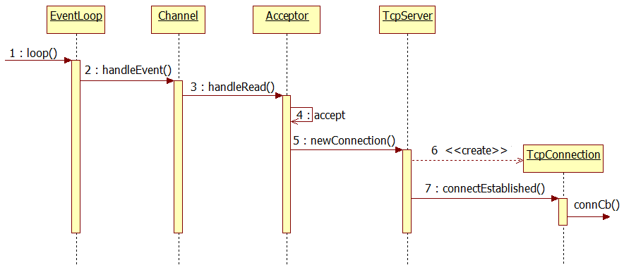

## muduo源码分析之TcpServer && TcpConnection ##

接下来用一个例子来说明这些类之间的调用关系，该案例的代码如下：

	#include <muduo/net/TcpServer.h>
	#include <muduo/net/EventLoop.h>
	#include <muduo/net/InetAddress.h>

	#include <stdio.h>

	using namespace muduo;
	using namespace muduo::net;

	void onConnection(const TcpConnectionPtr& conn)
	{
	  if (conn->connected())
	  {
	    printf("onConnection(): new connection [%s] from %s\n",
		   conn->name().c_str(),
		   conn->peerAddress().toIpPort().c_str());
	  }
	  else
	  {
	    printf("onConnection(): connection [%s] is down\n",
		   conn->name().c_str());
	  }
	}

	void onMessage(const TcpConnectionPtr& conn,
		       const char* data,
		       ssize_t len)
	{
	  printf("onMessage(): received %zd bytes from connection [%s]\n",
		 len, conn->name().c_str());
	}

	int main()
	{
	  printf("main(): pid = %d\n", getpid());

	  InetAddress listenAddr(8888);
	  EventLoop loop;

	  TcpServer server(&loop, listenAddr, "TestServer");
	  server.setConnectionCallback(onConnection);
	  server.setMessageCallback(onMessage);
	  server.start();

	  loop.loop();
	}

一开始测试程序创建了一个地址和事件循环，然后创建了一个TcpServer，传入一个EventLoop、地址和server名字，该构造函数定义如下：

 	TcpServer(EventLoop* loop, const InetAddress& listenAddr, const string& nameArg);
	 TcpServer::TcpServer(EventLoop* loop,
		             const InetAddress& listenAddr,
		             const string& nameArg)
	  : loop_(CHECK_NOTNULL(loop)),
	    hostport_(listenAddr.toIpPort()),
	    name_(nameArg),
	    acceptor_(new Acceptor(loop, listenAddr)),
	    started_(false),
	    nextConnId_(1)
	{
	  // Acceptor::handleRead函数中会回调用TcpServer::newConnection
	  // _1对应的是socket文件描述符，_2对应的是对等方的地址(InetAddress)
	  acceptor_->setNewConnectionCallback(
	      boost::bind(&TcpServer::newConnection, this, _1, _2));
	}

构造函数初始化的这些成员变量定义如下：

	  EventLoop* loop_;  // the acceptor loop
	  const string hostport_;		// 服务端口
	  const string name_;			// 服务名
	  boost::scoped_ptr<Acceptor> acceptor_; // avoid revealing Acceptor
	  ConnectionCallback connectionCallback_;
	  MessageCallback messageCallback_;
	  bool started_;
	  // always in loop thread
	  int nextConnId_;				// 下一个连接ID

上面的loop_、hostport和nameArg都比较好理解，可以看下面的acceptor_初始化：

	acceptor_(new Acceptor(loop, listenAddr))
	
创建了一个Acceptor，构造函数定义如下：

	Acceptor::Acceptor(EventLoop* loop, const InetAddress& listenAddr)
	  : loop_(loop),
	    acceptSocket_(sockets::createNonblockingOrDie()),
	    acceptChannel_(loop, acceptSocket_.fd()),
	    listenning_(false),
	    idleFd_(::open("/dev/null", O_RDONLY | O_CLOEXEC))
	{
	  assert(idleFd_ >= 0);
	  acceptSocket_.setReuseAddr(true);
	  acceptSocket_.bindAddress(listenAddr);
	  acceptChannel_.setReadCallback(
	      boost::bind(&Acceptor::handleRead, this));
	}

Acceptor类的分析上一节已经有了，不再做深入分析了，但可以确定的是，测试程序执行到这里后已经完成了监听套接字的socket、bind操作了。

回到TcpServer构造函数，接下来设置started标志为false，也就是说暂时还不处于监听状态，设置nextConnId_为1，这里和ConnectionMap相关，到后面再分析。

在构造函数体内部设置了acceptor_的连接事件函数：

 	acceptor_->setNewConnectionCallback(boost::bind(&TcpServer::newConnection, this, _1, _2));
 	
 其中绑定的是TcpServer::newConnection，该函数定义如下：
 
	 void TcpServer::newConnection(int sockfd, const InetAddress& peerAddr)
	{
	  loop_->assertInLoopThread();
	  char buf[32];
	  snprintf(buf, sizeof buf, ":%s#%d", hostport_.c_str(), nextConnId_);
	  ++nextConnId_;
	  string connName = name_ + buf;

	  LOG_INFO << "TcpServer::newConnection [" << name_
		   << "] - new connection [" << connName
		   << "] from " << peerAddr.toIpPort();
	  InetAddress localAddr(sockets::getLocalAddr(sockfd));
	  // FIXME poll with zero timeout to double confirm the new connection
	  // FIXME use make_shared if necessary
	  TcpConnectionPtr conn(new TcpConnection(loop_,
		                                  connName,
		                                  sockfd,
		                                  localAddr,
		                                  peerAddr));
	  connections_[connName] = conn;
	  conn->setConnectionCallback(connectionCallback_);
	  conn->setMessageCallback(messageCallback_);

	  conn->connectEstablished();
	}

该函数将在Acceptor::handleRead()中被调用，而Acceptor::handleRead()会在绑定的监听套接字有客户端连接事件时触发，用于处理连接客户端的请求。

继续分析TcpServer::newConnection函数，在函数体内将连接客户端的IP和端口保存到buf中，并打印。紧接着将nextConnId_执行加一操作，然后创建了一个TcpConnection，并将该连接及其名字保存到connections_中，该变量定义如下：

	typedef std::map<string, TcpConnectionPtr> ConnectionMap;
	ConnectionMap connections_;
	
可以看看创建TcpConnection时都做了什么事：

 	TcpConnection(EventLoop* loop, const string& name, int sockfd, const InetAddress& localAddr, const InetAddress& peerAddr);
 	
	 TcpConnection::TcpConnection(EventLoop* loop,
		                     const string& nameArg,
		                     int sockfd,
		                     const InetAddress& localAddr,
		                     const InetAddress& peerAddr)
	  : loop_(CHECK_NOTNULL(loop)),
	    name_(nameArg),
	    state_(kConnecting),
	    socket_(new Socket(sockfd)),
	    channel_(new Channel(loop, sockfd)),
	    localAddr_(localAddr),
	    peerAddr_(peerAddr)/*,
	    highWaterMark_(64*1024*1024)*/
	{
	  // 通道可读事件到来的时候，回调TcpConnection::handleRead，_1是事件发生时间
	  channel_->setReadCallback(
	      boost::bind(&TcpConnection::handleRead, this, _1));
	  LOG_DEBUG << "TcpConnection::ctor[" <<  name_ << "] at " << this
		    << " fd=" << sockfd;
	  socket_->setKeepAlive(true);
	}
 	
 这些赋值里需要注意的是：
 
	channel_(new Channel(loop, sockfd))

将主线程的EventLoop对象和上级代码的客户端连接套接字传入Channel，创建一个新的Channel，不过这个Channel保存的套接字是客户套接字，上级代码的那个是监听套接字。

然后将该通道的读回调函数设置为：

 	channel_->setReadCallback(boost::bind(&TcpConnection::handleRead, this, _1));
 
 TcpConnection::handleRead定义如下：
 
	void TcpConnection::handleRead(Timestamp receiveTime)
	{
	  loop_->assertInLoopThread();
	  char buf[65536];
	  ssize_t n = ::read(channel_->fd(), buf, sizeof buf);
	  messageCallback_(shared_from_this(), buf, n);
	}
 
 函数调用了系统的read函数读取来自客户端套接字的数据，然后会调用messageCallback_函数，messageCallback_函数暂时没有设置，但在后续会在调用方函数中设置。回到TcpServer::newConnection，果不其然，在创建TcpConnection之后：
 
	conn->setConnectionCallback(connectionCallback_);
	conn->setMessageCallback(messageCallback_);
	
这里测试代码将messageCallback_设置为：

	void onMessage(const TcpConnectionPtr& conn,
		   const char* data,
		   ssize_t len)
	{
	  printf("onMessage(): received %zd bytes from connection [%s]\n",
	     len, conn->name().c_str());
	}

服务端将获取到的客户端信息打印出来。

在设置完回调函数之后，测试函数执行：

	conn->connectEstablished();
	
该函数定义如下：

	void TcpConnection::connectEstablished()
	{
	  loop_->assertInLoopThread();
	  assert(state_ == kConnecting);
	  setState(kConnected);
	  channel_->tie(shared_from_this());
	  channel_->enableReading();	// TcpConnection所对应的通道加入到Poller关注

	  connectionCallback_(shared_from_this());
	}
	
该函数将TcpConnection所对应的通道加入到Poller关注，然后调用了connectionCallback_函数，也就是：

	void onConnection(const TcpConnectionPtr& conn)
	{
	  if (conn->connected())
	  {
	    printf("onConnection(): new connection [%s] from %s\n",
	       conn->name().c_str(),
	       conn->peerAddress().toIpPort().c_str());
	  }
	  else
	  {
	    printf("onConnection(): connection [%s] is down\n",
	       conn->name().c_str());
	  }
	}
	
该函数将会打印客户端连接信息。

到这里，这两个类的调用就基本分析完了，总结下来就是：

 