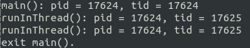

## muduo源码分析之EventLoop（扩充）&& EventLoopThread ##

任何一个线程，只要创建并运行了EventLoop，都称之为IO线程，所以IO线程不一定是主线程。

muduo并发模型one loop per thread + threadpool，为了方便今后使用，定义了EventLoopThread类，该类封装了IO线程。EventLoopThread创建了一个线程，然后在线程函数中创建了一个EvenLoop对象并调用EventLoop::loop。

下面也是通过一个案例来分析该类，由于需要支持在不同线程中使用EventLoop，所以EventLoop也需要做出一些改进。该测试代码如下所示：

	#include <muduo/net/EventLoop.h>
	#include <muduo/net/EventLoopThread.h>

	#include <stdio.h>

	using namespace muduo;
	using namespace muduo::net;

	void runInThread()
	{
	  printf("runInThread(): pid = %d, tid = %d\n",
		 getpid(), CurrentThread::tid());
	}

	int main()
	{
	  printf("main(): pid = %d, tid = %d\n",
		 getpid(), CurrentThread::tid());

	  EventLoopThread loopThread;
	  EventLoop* loop = loopThread.startLoop();
	  // 异步调用runInThread，即将runInThread添加到loop对象所在IO线程，让该IO线程执行
	  loop->runInLoop(runInThread);
	  sleep(1);
	  // runAfter内部也调用了runInLoop，所以这里也是异步调用
	  loop->runAfter(2, runInThread);
	  sleep(3);
	  loop->quit();

	  printf("exit main().\n");
	}
首先在主函数中打印了主线程的ID号，然后创建了一个EventLoopThread对象：

	EventLoopThread loopThread;
	
该类的购置函数定义如下：

	EventLoopThread(const ThreadInitCallback& cb = ThreadInitCallback());

	EventLoopThread::EventLoopThread(const ThreadInitCallback& cb)
	  : loop_(NULL),
	    exiting_(false),
	    thread_(boost::bind(&EventLoopThread::threadFunc, this)),
	    mutex_(),
	    cond_(mutex_),
	    callback_(cb)
	{
	}
	
初始化的变量如下所示：

	typedef boost::function<void(EventLoop*)> ThreadInitCallback;

	EventLoop* loop_;			// loop_指针指向一个EventLoop对象
	bool exiting_;
	Thread thread_;
	MutexLock mutex_;
	Condition cond_;
	ThreadInitCallback callback_;		// 回调函数在EventLoop::loop事件循环之前被调用
	
很多成员变量初始化都很好理解，但是这里需要注意的是thread_的初始化：

 	thread_(boost::bind(&EventLoopThread::threadFunc, this)),
 	
 该线程类绑定的执行函数是EventLoopThread::threadFunc，该函数定义如下：
 
	 void EventLoopThread::threadFunc()
	{
	  EventLoop loop;

	  if (callback_)
	  {
	    callback_(&loop);
	  }

	  {
	    MutexLockGuard lock(mutex_);
	    // loop_指针指向了一个栈上的对象，threadFunc函数退出之后，这个指针就失效了
	    // threadFunc函数退出，就意味着线程退出了，EventLoopThread对象也就没有存在的价值了。
	    // 因而不会有什么大的问题
	    loop_ = &loop;
	    cond_.notify();
	  }

	  loop.loop();
	  //assert(exiting_);
	}
	
该函数初始化了一个EventLoop对象，也就是在线程中创建了一个EventLoop对象，接着判断callback_是否为空如果不为空，则将该EventLoop对象传入并执行，紧接着加锁，将在该线程函数中创建的EventLoop对象赋值给EventLoopThread的成员变量loop_，然后会通知条件变量释放。接着会在子线程中调用loop.loop()开始监听。当然这个代码只有在Thread类（这里调用EventLoop* EventLoopThread::startLoop()会启动，后面会分析到）启动后才会执行，在EventLoopThread初始化时不会执行。

回到测试函数，在创建完一个EventLoopThread对象后，测试函数启动了该EventLoopThread类：

	EventLoop* loop = loopThread.startLoop();
	
直接调用：

	EventLoop* EventLoopThread::startLoop()
	{
	  assert(!thread_.started());
	  thread_.start();

	  {
	    MutexLockGuard lock(mutex_);
	    while (loop_ == NULL)
	    {
	      cond_.wait();
	    }
	  }

	  return loop_;
	}
	
该函数将调用

	thread_.start();
	
从而导致EventLoopThread::threadFunc()被调用，EventLoopThread::threadFunc()会给loop_赋值，所以startLoop()函数会一直卡在下面循环中，直到成员变量loop_创建为止：

	{
		MutexLockGuard lock(mutex_);
		while (loop_ == NULL)
		{
			cond_.wait();
		}
	}

最后该函数返回loop_指针，到这里，EventLoopThread创建的线程里已经有一个在loop()的EventLoop对象了，也就是返回的loop_指向的对象。

回到测试函数，获取到子线程中的EventLoop对象后：

	loop->runInLoop(runInThread);

异步调用loop->runInLoop()函数，该函数定义如下：

	// 在I/O线程中执行某个回调函数，该函数可以跨线程调用
	void EventLoop::runInLoop(const Functor& cb)
	{
	  if (isInLoopThread())
	  {
	    // 如果是当前IO线程调用runInLoop，则同步调用cb
	    cb();
	  }
	  else
	  {
	    // 如果是其它线程调用runInLoop，则异步地将cb添加到队列
	    queueInLoop(cb);
	  }
	}

很明显，EventLoop对象是在子线程中创建的，然而却是在主线程中调用runInLoop函数，所以直接执行：

	queueInLoop(cb);

该函数定义如下：

	void EventLoop::queueInLoop(const Functor& cb)
	{
	  {
	  MutexLockGuard lock(mutex_);
	  pendingFunctors_.push_back(cb);
	  }

	  // 调用queueInLoop的线程不是IO线程需要唤醒
	  // 或者调用queueInLoop的线程是IO线程，并且此时正在调用pending functor，需要唤醒
	  // 只有IO线程的事件回调中调用queueInLoop才不需要唤醒
	  if (!isInLoopThread() || callingPendingFunctors_)
	  {
	    wakeup();
	  }
	}
	
该函数将需要被执行的函数cb放到一个未处理函数集合中：

	pendingFunctors_.push_back(cb);
	
该集合定义如下：

 	std::vector<Functor> pendingFunctors_;
 
 然后判断是否执行wakeup()函数，判断的依据是：
 
	 (!isInLoopThread() || callingPendingFunctors_)
 
 isInLoopThread()返回值肯定是false所以条件成立，可以执行wakeup()，callingPendingFunctors_定义如下：
 
 	bool callingPendingFunctors_; /* atomic */
 
 现在看看wakeup函数定义：
 
	 void EventLoop::wakeup()
	{
	  uint64_t one = 1;
	  //ssize_t n = sockets::write(wakeupFd_, &one, sizeof one);
	  ssize_t n = ::write(wakeupFd_, &one, sizeof one);
	  if (n != sizeof one)
	  {
	    LOG_ERROR << "EventLoop::wakeup() writes " << n << " bytes instead of 8";
	  }
	}

该函数绑定了一个wakeupFd_，定义如下：

 	int wakeupFd_;
 
在wakeup函数中调用了write函数，于是在EventLoop中的loop()会得到该事件，然后在一轮循环中会执行到：

	 doPendingFunctors();
 
 该函数定义如下：
 
	 void EventLoop::doPendingFunctors()
	{
	  std::vector<Functor> functors;
	  callingPendingFunctors_ = true;

	  {
	  MutexLockGuard lock(mutex_);
	  functors.swap(pendingFunctors_);
	  }

	  for (size_t i = 0; i < functors.size(); ++i)
	  {
	    functors[i]();
	  }
	  callingPendingFunctors_ = false;
	}

该函数会依次取出未决函数集合中的函数并执行，所以测试函数中的

	void runInThread()
	{
	  printf("runInThread(): pid = %d, tid = %d\n",
		 getpid(), CurrentThread::tid());
	}

会在

	loop->runInLoop(runInThread);

调用后执行。

回到测试函数：

	loop->runAfter(2, runInThread);
	
该函数定义如下：

	TimerId EventLoop::runAfter(double delay, const TimerCallback& cb)
	{
	  Timestamp time(addTime(Timestamp::now(), delay));
	  return runAt(time, cb);
	}
	
然后调用到：

	TimerId EventLoop::runAt(const Timestamp& time, const TimerCallback& cb)
	{
	  return timerQueue_->addTimer(cb, time, 0.0);
	}

到了时间就自动执行。所以最后编译运行结果如下：

 