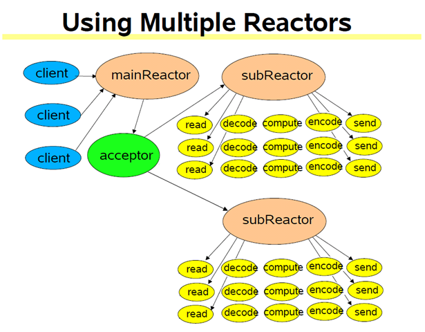
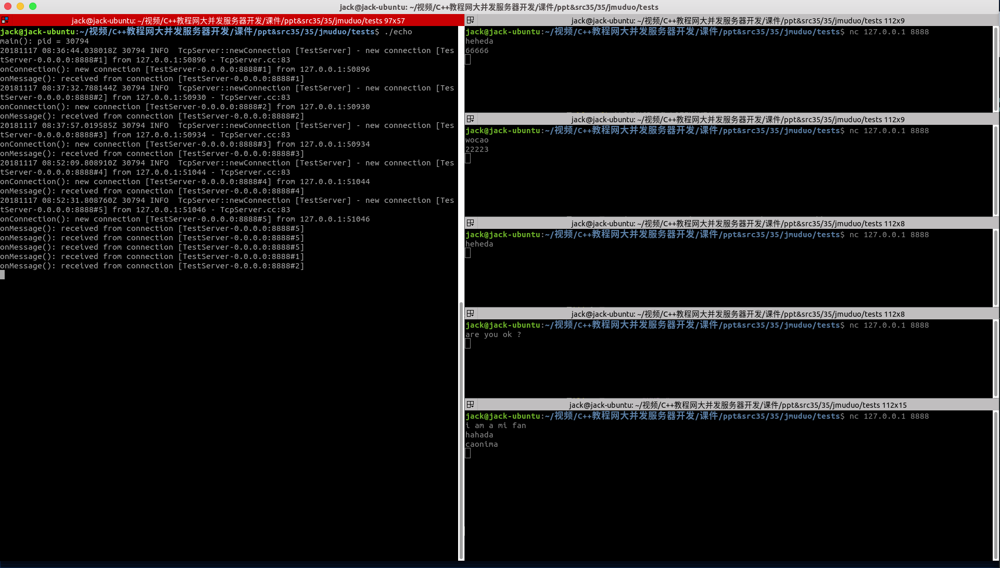

## muduo源码分析--TcpServer扩充 && EventLoopThreadPool ##

这部分主要分析muduo库如何支持多线程。muduo使用EventLoopThread（IO线程类）和EventLoopThreadPool（IO线程池类）来支持多线程，其中，IO线程池的功能是开启若干个IO线程，并让这些IO线程处于事件循环的状态。

下面这张图很好地说明了muduo的线程池+多路IO复用模式：

 
也就是说，不论是主线程还是子线程都可以是一个Reactor。

同样地，下面以一个案例来分析EventLoopThreadPool的使用和调用过程。

该案例代码如下;

	#include <muduo/net/TcpServer.h>
	#include <muduo/net/EventLoop.h>
	#include <muduo/net/InetAddress.h>

	#include <boost/bind.hpp>

	#include <stdio.h>

	using namespace muduo;
	using namespace muduo::net;

	class TestServer
	{
	 public:
	  TestServer(EventLoop* loop,
		     const InetAddress& listenAddr, int numThreads)
	    : loop_(loop),
	      server_(loop, listenAddr, "TestServer"),
	      numThreads_(numThreads)
	  {
	    server_.setConnectionCallback(boost::bind(&TestServer::onConnection, this, _1));
	    server_.setMessageCallback(boost::bind(&TestServer::onMessage, this, _1));
	    server_.setThreadNum(numThreads);
	  }

	  void start()
	  {
		  server_.start();
	  }

	 private:
	  void onConnection(const TcpConnectionPtr& conn)
	  {
	    if (conn->connected())
	    {
	      printf("onConnection(): new connection [%s] from %s\n",
		     conn->name().c_str(),
		     conn->peerAddress().toIpPort().c_str());
	    }
	    else
	    {
	      printf("onConnection(): connection [%s] is down\n",
		     conn->name().c_str());
	    }
	  }

	  void onMessage(const TcpConnectionPtr& conn)
	  {
	    printf("onMessage(): received from connection [%s]\n",
		    conn->name().c_str());
	  }

	  EventLoop* loop_;
	  TcpServer server_;
	  int numThreads_;
	};

	int main()
	{
	  printf("main(): pid = %d\n", getpid());

	  InetAddress listenAddr(8888);
	  EventLoop loop;

	  TestServer server(&loop, listenAddr,4);
	  server.start();

	  loop.loop();
	}

直接冲TestServer类的构造函数开始分析：

	  TestServer(EventLoop* loop,
		     const InetAddress& listenAddr, int numThreads)
	    : loop_(loop),
	      server_(loop, listenAddr, "TestServer"),
	      numThreads_(numThreads)
	  {
	    server_.setConnectionCallback(boost::bind(&TestServer::onConnection, this, _1));
	    server_.setMessageCallback(boost::bind(&TestServer::onMessage, this, _1));
	    server_.setThreadNum(numThreads);
	  }
	  
该构造函数接收一个EventLoop、一个监听套接字地址和创建线程数量（测试代码里设置为4）。其中需要注意的是TcpServer类，该类较上一节的分析有加入了很多内容，主要是关于线程池，所以有必要再分析，新的TcpServer构造函数如下：

	TcpServer::TcpServer(EventLoop* loop,
		             const InetAddress& listenAddr,
		             const string& nameArg)
	  : loop_(CHECK_NOTNULL(loop)),
	    hostport_(listenAddr.toIpPort()),
	    name_(nameArg),
	    acceptor_(new Acceptor(loop, listenAddr)),
	    threadPool_(new EventLoopThreadPool(loop)),
	    /*connectionCallback_(defaultConnectionCallback),
	    messageCallback_(defaultMessageCallback),*/
	    started_(false),
	    nextConnId_(1)
	{
	  // Acceptor::handleRead函数中会回调用TcpServer::newConnection
	  // _1对应的是socket文件描述符，_2对应的是对等方的地址(InetAddress)
	  acceptor_->setNewConnectionCallback(
	      boost::bind(&TcpServer::newConnection, this, _1, _2));
	}
	
关于TcpServer，下面只着重分析新增加的内容。

注意到构造函数中初始化列表中有：

	threadPool_(new EventLoopThreadPool(loop)),
	
该成员变量定义如下：

 	boost::scoped_ptr<EventLoopThreadPool> threadPool_;
 
EventLoopThreadPool类的构造函数如下：
 
	EventLoopThreadPool(EventLoop* baseLoop);
	 
	EventLoopThreadPool::EventLoopThreadPool(EventLoop* baseLoop)
	  : baseLoop_(baseLoop),
	    started_(false),
	    numThreads_(0),
	    next_(0)
	{
	}
	
构造函数的初始化列表成员变量定义如下：

	EventLoop* baseLoop_;	// 与Acceptor所属EventLoop相同
	  bool started_;
	  int numThreads_;		// 线程数
	  int next_;			// 新连接到来，所选择的EventLoop对象下标
	  
回到TcpServer的构造函数，在构造函数体内部：

	  // Acceptor::handleRead函数中会回调用TcpServer::newConnection
	  // _1对应的是socket文件描述符，_2对应的是对等方的地址(InetAddress)
	  acceptor_->setNewConnectionCallback(boost::bind(&TcpServer::newConnection, this, _1, _2));
	  
Accptor连接绑定函数为TcpServer::newConnection，该函数和上一节又不一样了，暂时到该函数调用时再分析。

回到测试代码的TestServer中，在其构造函数中设置了：

	server_.setConnectionCallback(boost::bind(&TestServer::onConnection, this, _1));
	server_.setMessageCallback(boost::bind(&TestServer::onMessage, this, _1));
	server_.setThreadNum(numThreads);
	
以上需要注意的是设置线程数量函数：

	void TcpServer::setThreadNum(int numThreads)
	{
	  assert(0 <= numThreads);
	  threadPool_->setThreadNum(numThreads);
	}

它调用了线程池的setThreadNum函数，该函数定义如下;

	void setThreadNum(int numThreads) { numThreads_ = numThreads; }

回到测试代码的main函数中，初始化完成TestServer后，启动该server：

	server.start();

它的定义如下：

	void start()
	{
	  server_.start();
	}
  
 调用了TcpServer的start函数，该函数定义如下：
 
	 // 该函数多次调用是无害的
	// 该函数可以跨线程调用
	void TcpServer::start()
	{
	  if (!started_)
	  {
	    started_ = true;
		threadPool_->start(threadInitCallback_);
	  }

	  if (!acceptor_->listenning())
	  {
		// get_pointer返回原生指针
	    loop_->runInLoop(
		boost::bind(&Acceptor::listen, get_pointer(acceptor_)));
	  }
	}

首先设置started_标志为true，然后调用：

	threadPool_->start(threadInitCallback_);

进而有：

	void EventLoopThreadPool::start(const ThreadInitCallback& cb)
	{
	  assert(!started_);
	  baseLoop_->assertInLoopThread();

	  started_ = true;

	  for (int i = 0; i < numThreads_; ++i)
	  {
	    EventLoopThread* t = new EventLoopThread(cb);
	    threads_.push_back(t);
	    loops_.push_back(t->startLoop());	// 启动EventLoopThread线程，在进入事件循环之前，会调用cb
	  }
	  if (numThreads_ == 0 && cb)
	  {
	    // 只有一个EventLoop，在这个EventLoop进入事件循环之前，调用cb
	    cb(baseLoop_);
	  }
	}
	
由于没有对threadInitCallback_进行设置，所以这部分调用会没有任何效果，接下来创建了numThreads_个线程，这里设置为4：

	for (int i = 0; i < numThreads_; ++i)
	{
		EventLoopThread* t = new EventLoopThread(cb);
		threads_.push_back(t);
		loops_.push_back(t->startLoop());	// 启动EventLoopThread线程，在进入事件循环之前，会调用cb
	}
	
将每个事件线程放到线程集合中，线程集合定义如下：

	boost::ptr_vector<EventLoopThread> threads_;		// IO线程列表
	
然后再将每个事件线程中创建的EventLoop对象保存到集合loops_中，其定义如下：

	std::vector<EventLoop*> loops_;					// EventLoop列表

需要注意的是获取EventLoop的方法，这里调用了t->startLoop()函数：

	EventLoop* EventLoopThread::startLoop()
	{
	  assert(!thread_.started());
	  thread_.start();

	  {
	    MutexLockGuard lock(mutex_);
	    while (loop_ == NULL)
	    {
	      cond_.wait();
	    }
	  }

	  return loop_;
	}

该语句threads_.push_back(t)执行后四个事件循环也在它们的调用线程中调用了。

回到测试代码的main函数，最后行：

	loop.loop();
	
之后，整个程序便处于监听状态了，一旦有客户连接上，那么将触发TcpServer::newConnection函数，上面只是介绍了而已，下面将具体说明该函数的运作过程：

	void TcpServer::newConnection(int sockfd, const InetAddress& peerAddr)
	{
	  loop_->assertInLoopThread();
	  // 按照轮叫的方式选择一个EventLoop
	  EventLoop* ioLoop = threadPool_->getNextLoop();
	  char buf[32];
	  snprintf(buf, sizeof buf, ":%s#%d", hostport_.c_str(), nextConnId_);
	  ++nextConnId_;
	  string connName = name_ + buf;

	  LOG_INFO << "TcpServer::newConnection [" << name_
		   << "] - new connection [" << connName
		   << "] from " << peerAddr.toIpPort();
	  InetAddress localAddr(sockets::getLocalAddr(sockfd));
	  TcpConnectionPtr conn(new TcpConnection(ioLoop,
		                                  connName,
		                                  sockfd,
		                                  localAddr,
		                                  peerAddr));

	  LOG_TRACE << "[1] usecount=" << conn.use_count();
	  connections_[connName] = conn;
	  LOG_TRACE << "[2] usecount=" << conn.use_count();
	  conn->setConnectionCallback(connectionCallback_);
	  conn->setMessageCallback(messageCallback_);

	  conn->setCloseCallback(
	      boost::bind(&TcpServer::removeConnection, this, _1));

	  // conn->connectEstablished();
	  ioLoop->runInLoop(boost::bind(&TcpConnection::connectEstablished, conn));
	  LOG_TRACE << "[5] usecount=" << conn.use_count();

	}

该函数如果被调用，说明有客户活动了，传入的sockfd和peerAddr也是客户的。

接下来调用

	EventLoop* ioLoop = threadPool_->getNextLoop();
	
从EventLoop池中轮循选择一个EventLoop对象来处理处理该客户端连接：

	EventLoop* EventLoopThreadPool::getNextLoop()
	{
	  baseLoop_->assertInLoopThread();
	  EventLoop* loop = baseLoop_;

	  // 如果loops_为空，则loop指向baseLoop_
	  // 如果不为空，按照round-robin（RR，轮叫）的调度方式选择一个EventLoop
	  if (!loops_.empty())
	  {
	    // round-robin
	    loop = loops_[next_];
	    ++next_;
	    if (implicit_cast<size_t>(next_) >= loops_.size())
	    {
	      next_ = 0;
	    }
	  }
	  return loop;
	}

然后紧接着便创建了TcpConnection对象，设置连接和消息到达时的回调函数，这里便是测试代码中的：

	void onConnection(const TcpConnectionPtr& conn)
	{
		if (conn->connected())
		{
			printf("onConnection(): new connection [%s] from %s\n",
			     conn->name().c_str(),
			     conn->peerAddress().toIpPort().c_str());
		}
		else
		{
			printf("onConnection(): connection [%s] is down\n",
			     conn->name().c_str());
		}
	}

	void onMessage(const TcpConnectionPtr& conn)
	{
		printf("onMessage(): received from connection [%s]\n",
		    conn->name().c_str());
	}

也就是打印客户名和IP等信息。

该测试程序的运行结果如下所示：

 